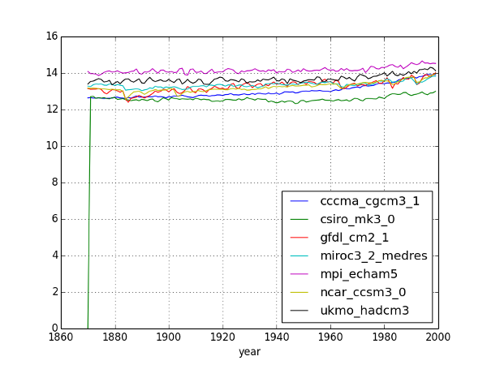

flaskpd
=======

flask visualization API, backed by Pandas + SQL

To run the demo app, you'll need to load 'data/temp.csv' into 
a 'temperatures' table on the database specified in settings.py.

With plain-old static-file Matplotlib:

With D3.js-based [Rickshaw.js](http://code.shutterstock.com/rickshaw/):

